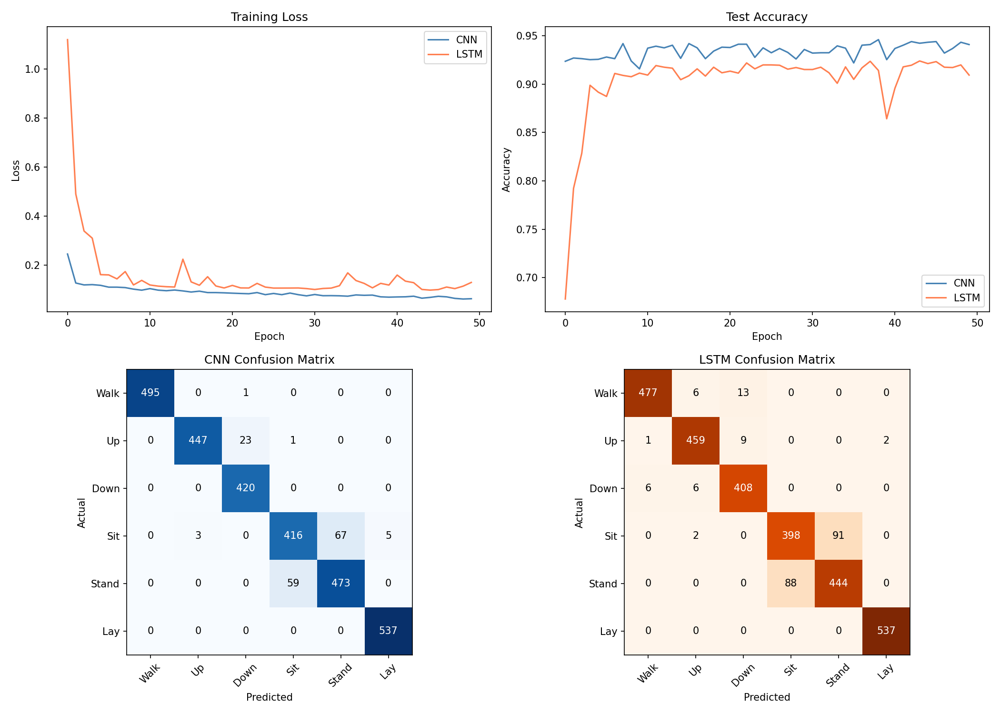

# Human Activity Recognition with Edge Deployment

Classifying human activities from smartphone sensor data using deep learning, with model optimization for edge deployment.



## Overview

This project builds an end-to-end machine learning pipeline that takes raw accelerometer and gyroscope data from smartphones and predicts which physical activity a person is performing. The system achieves **94.6% accuracy** using a 1D CNN on 9-channel sensor data, and demonstrates model optimization through ONNX export and quantization for deployment on resource-constrained devices like smartwatches and phones.

### Key Results

| Model | Accuracy | F1 Score | Parameters | Training Time |
|-------|----------|----------|------------|---------------|
| Random Forest (baseline) | 83.8% | 83.6% | N/A | <1s |
| LSTM | 92.4% | 92.4% | 204K | 467s |
| **1D CNN** | **94.6%** | **94.7%** | **145K** | **387s** |

### Optimization Results

| Metric | Original | Quantized |
|--------|----------|-----------|
| Model Size | 565 KB | 150 KB |
| Accuracy | 94.6% | 94.9% |
| Size Reduction | — | **73.5%** |

The quantized model is **3.8x smaller** with **no accuracy loss**, making it suitable for edge deployment.

## Dataset

The [UCI HAR Dataset](https://archive.ics.uci.edu/ml/datasets/human+activity+recognition+using+smartphones) contains smartphone sensor recordings from 30 participants performing 6 activities:

- Walking, Walking Upstairs, Walking Downstairs
- Sitting, Standing, Laying

Each sample is a 2.56-second window (128 timesteps) captured at 50Hz across 9 sensor channels: 3-axis body accelerometer, 3-axis gyroscope, and 3-axis total acceleration.

**Training set:** 7,352 samples | **Test set:** 2,947 samples

## Architecture

### 1D CNN (Best Model)

```
Input (batch, 9, 128)
  → Conv1d(9→64, k=5) → BatchNorm → ReLU → MaxPool(2)     [128→64]
  → Conv1d(64→128, k=5) → BatchNorm → ReLU → MaxPool(2)   [64→32]
  → Conv1d(128→256, k=3) → BatchNorm → ReLU → MaxPool(2)  [32→16]
  → AdaptiveAvgPool1d(1)                                    [16→1]
  → Dropout(0.3) → Linear(256→6)
Output: 6 activity classes
```

The CNN processes all timesteps in parallel using sliding filters, progressively learning low-level patterns (individual motion spikes) to high-level patterns (rhythmic walking sequences). Global average pooling collapses the time dimension, and dropout prevents overfitting.

### Per-Class Performance

| Activity | Accuracy |
|----------|----------|
| Walking | 99.4% |
| Walking Upstairs | 96.8% |
| Walking Downstairs | 97.9% |
| Sitting | 84.9% |
| Standing | 91.0% |
| Laying | 100.0% |

The model achieves near-perfect accuracy on dynamic activities but shows some confusion between Sitting and Standing — expected since both involve minimal motion and produce similar accelerometer signals.

## Project Structure

```
har-sensor-ml/
├── data/                  # UCI HAR Dataset (not tracked — see setup)
├── models/
│   ├── har_cnn.onnx       # Exported ONNX model
│   └── har_cnn_quantized.onnx  # Quantized ONNX model (73.5% smaller)
├── notebooks/
│   ├── 01_data_exploration.ipynb   # EDA, model training, baseline comparison
│   └── 02_model_optimization.ipynb # ONNX export and quantization
├── src/
│   ├── app.py             # FastAPI inference server
│   └── test_api.py        # API test script
├── results/               # Plots and benchmarks
├── README.md
└── requirements.txt
```

## Setup & Reproduction

### 1. Clone and install dependencies

```bash
git clone https://github.com/nisulay/har-sensor-ml.git
cd har-sensor-ml
pip install -r requirements.txt
```

### 2. Download the dataset

```bash
cd data
curl -O https://archive.ics.uci.edu/ml/machine-learning-databases/00240/UCI%20HAR%20Dataset.zip
unzip UCI%20HAR%20Dataset.zip
cd ..
```

### 3. Run the notebooks

Open `notebooks/01_data_exploration.ipynb` to reproduce training, then `notebooks/02_model_optimization.ipynb` for ONNX export and quantization.

### 4. Run the inference API

```bash
uvicorn src.app:app --reload
```

Test with real sensor data:

```bash
python src/test_api.py
```

Example response:

```json
{
  "activity": "Walking Downstairs",
  "confidence": 0.999,
  "all_probabilities": {
    "Walking": 0.0003,
    "Walking Upstairs": 0.0002,
    "Walking Downstairs": 0.999,
    "Sitting": 0.0,
    "Standing": 0.0,
    "Laying": 0.0
  }
}
```

## Methodology

1. **Data Preprocessing**: Z-score normalization per sensor channel using training set statistics only (prevents data leakage)
2. **Baseline**: Random Forest on hand-crafted features (mean, std, min, max, median per channel) — 83.8% accuracy
3. **CNN**: 1D convolutional network on raw sensor signals — 94.6% accuracy (+11 percentage points over baseline)
4. **LSTM**: Recurrent network processing the sequence step-by-step — 92.4% accuracy
5. **Optimization**: ONNX export with dynamic quantization — 73.5% size reduction, no accuracy loss
6. **Deployment**: FastAPI endpoint serving the quantized model for real-time inference

## Technologies

- **PyTorch** — model development and training
- **ONNX / ONNX Runtime** — model export and optimized inference
- **scikit-learn** — baseline model and evaluation metrics
- **FastAPI** — inference API server
- **NumPy / Pandas / Matplotlib** — data processing and visualization

## Future Work

- Deploy ONNX model directly on mobile device using ONNX Runtime Mobile
- Add real-time inference from phone sensors via WebSocket streaming
- Experiment with transformer-based architectures for temporal modeling
- Implement transfer learning for cross-device generalization
- Add Grad-CAM visualizations to interpret which sensor patterns drive predictions

## Author

**Nikhil Sulay** — MS Computer Science, Georgia Institute of Technology  
[LinkedIn](https://linkedin.com/in/nsulay) | [GitHub](https://github.com/nisulay)
